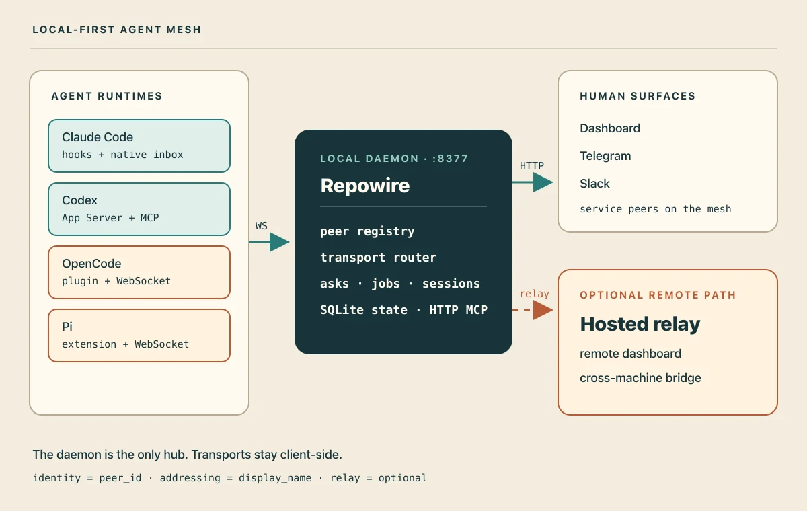
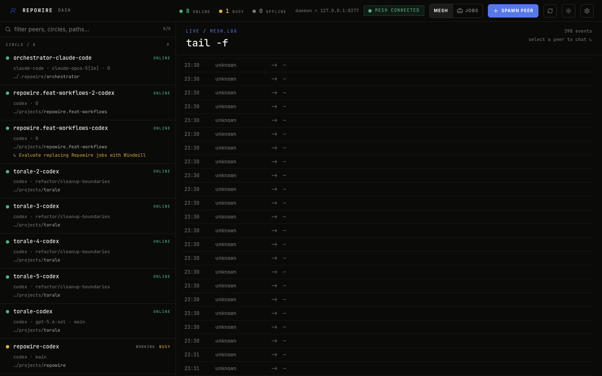

<div align="center">
  <picture>
    <source srcset="https://raw.githubusercontent.com/prassanna-ravishankar/repowire/main/images/logo-dark.webp" media="(prefers-color-scheme: dark)" width="150" height="150" />
    
  </picture>

  <h1>Repowire</h1>
  <p>Local-first operating layer for agent teams.</p>

  [](https://pypi.org/project/repowire/)
  [](https://github.com/prassanna-ravishankar/repowire/actions/workflows/ci.yml)
  [](https://pypi.org/project/repowire/)
  [](https://github.com/prassanna-ravishankar/repowire/blob/main/LICENSE)
  [](https://deepwiki.com/prassanna-ravishankar/repowire)
</div>

Repowire is a local-first harness for working with more than one coding agent at a time. It gives every live Claude Code, Codex, Gemini CLI, OpenCode, or Pi session an address in a shared mesh, so agents can ask each other questions, send updates, schedule follow-ups, and coordinate without copy-paste handoffs.

Think of it as the lightweight operating layer around your agent team: a communication mesh, an orchestrator path for multi-repo work, and a set of human controls for when you want to steer from a browser, Telegram, or Slack.

Use it when:

- One repo needs a concrete answer from an agent already working in another repo.
- You want a personal orchestrator session to dispatch tasks, collect status, or keep reviews moving.
- You want to monitor or nudge agent work from your phone or browser.
- A session should wake itself or another peer later with a scheduled check-in.

Repowire runs locally by default through a daemon on your machine. The hosted relay is optional and uses outbound connections for remote dashboard access and cross-machine mesh traffic.

## Quickstart

**Requirements:** macOS or Linux, Python 3.10+, tmux.

```bash
# One-liner: detects uv/pipx/pip, installs repowire, runs setup
curl -sSf https://raw.githubusercontent.com/prassanna-ravishankar/repowire/main/install.sh | sh

# Or install manually
uv tool install repowire    # or: pipx install repowire / pip install repowire
repowire setup
```

Open two agent sessions in separate tmux windows:

```bash
# tmux window 1
cd ~/projects/project-a && claude

# tmux window 2
cd ~/projects/project-b && codex
```

Both sessions auto-register as peers. In `project-a`, ask:

```text
Ask project-b what API endpoints they expose.
```

The first agent calls `ask`, the second receives the question, and the reply comes back as an `ack` notification. The same pattern works across Claude Code, Codex, Gemini CLI, OpenCode, and Pi when those runtimes are installed.

You can also spawn peers through Repowire:

```bash
repowire peer new ~/projects/project-a
repowire peer new ~/projects/project-b
```

Full docs: [docs.repowire.io](https://docs.repowire.io).

## What You Get

- **Agent-to-agent asks.** Non-blocking questions with explicit `ack` replies and reminder injection until a thread is closed.
- **Human control surfaces.** Browser dashboard, Telegram, and Slack can route messages as service peers.
- **Orchestrator pattern.** A dedicated peer can dispatch work, check status, coordinate reviews, and keep a queue moving.
- **Scheduled wake-ups.** Send a future notification or ask to yourself, another peer, or an orchestrator.
- **Optional relay.** Reach the dashboard remotely and bridge machines without opening inbound ports.

## How It Works

All peers connect to a local daemon. The daemon keeps the registry, routes asks/notifies, tracks open asks, runs schedules, and feeds the dashboard timeline.

<p align="center">
  
</p>

The stable public surface is still peers, circles, asks, notifications, broadcasts, and schedules. The v0.13 direction is session-native: sessions become the durable unit of work, while peers remain the live runtime executors. The current dashboard shows the selected peer/session view, merges Claude transcript history where available with realtime events, and is moving toward broader session commands for controls like resume, scheduling, approvals, and future backend/model changes.

Transport notes:

- Claude Code, Codex, and Gemini CLI use hooks plus MCP tools.
- OpenCode uses a TypeScript plugin plus WebSocket.
- Pi uses the Repowire extension path when detected by setup.
- Claude Code channel/ACP delivery is experimental and opt-in.
- Relay is optional remote access, not a requirement for local routing.

## Supported Agents and Surfaces

| Agent runtime | Connection path |
| --- | --- |
| Claude Code | Hooks + MCP; optional experimental channel/ACP transport |
| Codex | Hooks + MCP |
| Gemini CLI | Hooks + MCP through normalized `BeforeAgent` / `AfterAgent` events |
| OpenCode | Plugin + WebSocket |
| Pi | Repowire extension |

| Human or service surface | Role in the mesh |
| --- | --- |
| Dashboard | Browser control surface at `localhost:8377/dashboard` or through relay |
| Telegram | Phone control surface and notification target |
| Slack | Team chat control surface |
| Orchestrator peer | Long-running coordinator that dispatches and reviews work |
| Relay dashboard | Optional remote dashboard and cross-machine bridge |

`repowire setup` auto-detects installed runtimes and wires the supported transports it finds.

## Common Workflows

### Ask another repo

Project A needs the real API shape from Project B. Ask `project-b`; the peer answers from its live checkout, not stale docs. See [multi-repo coordination](https://docs.repowire.io/patterns/multi-repo/).

### Drive from phone or dashboard

Send work to a peer from Telegram, Slack, or the dashboard, then receive progress updates from agents as notifications. Telegram and Slack human messages open tracked asks by default; use their notify/FYI commands for fire-and-forget nudges. See [mobile mesh management](https://docs.repowire.io/patterns/mobile-mesh/).

### Coordinate with an orchestrator

Run one session as the orchestrator. It can dispatch to project peers, ask for status, review PRs, and wake itself later. See [orchestrator coordination](https://docs.repowire.io/patterns/orchestrator-coordination/).

### Wake a peer later

Schedule a reminder, check-in, or future ask:

```bash
repowire schedule self 10m "check CI"
repowire schedule create orchestrator 1h "handoff" --from-peer project-a --kind ask
```

### Bridge machines

Enable the hosted relay when you want remote dashboard access or cross-machine mesh traffic:

```bash
repowire setup --relay
```

## Dashboard

<p align="center">
  
</p>

The dashboard shows peers, status, descriptions, chat turns, tool calls, attachments, and the selected peer/session timeline. For Claude Code peers, it can merge transcript history with realtime events; other backends contribute realtime events as their transports report them.

Run it locally at:

```text
http://localhost:8377/dashboard
```

With relay enabled, use:

```text
https://repowire.io/dashboard
```

## Core Commands

```bash
repowire setup                         # install hooks/MCP/plugin/service for detected agents
repowire status                        # show installed components and daemon status
repowire doctor                        # run diagnostics
repowire service restart               # restart the installed daemon service
repowire peer list                     # list mesh peers
repowire peer new PATH                 # spawn a peer in tmux
repowire schedule self 10m "check CI"  # wake this peer later
repowire telegram start                # run Telegram service peer
repowire slack start                   # run Slack service peer
```

See the full [CLI reference](https://docs.repowire.io/reference/cli/) and [MCP tools reference](https://docs.repowire.io/reference/mcp-tools/).

## Configuration and Security

Config lives at `~/.repowire/config.yaml`.

```yaml
daemon:
  host: "127.0.0.1"
  port: 8377
  auth_token: "optional-secret"
  spawn:
    allowed_commands: [claude, codex, gemini]
    allowed_paths: [~/git, ~/projects]

relay:
  enabled: true
  url: "wss://repowire.io"
  api_key: "rw_..."
```

Security defaults:

- Local daemon binds to `127.0.0.1`.
- Relay is opt-in and uses outbound WebSocket.
- WebSocket auth is available through `daemon.auth_token`.
- Spawn requires explicit command and path allowlists.
- Experimental channel/ACP transport is opt-in.

## Developing From Source

```bash
git clone https://github.com/prassanna-ravishankar/repowire
cd repowire
uv sync --extra dev
uv tool install . --force-reinstall
```

Hooks and MCP servers run the installed `repowire` executable, not your checkout. After changing daemon, hook, or MCP code locally, reinstall the tool and restart the daemon service so the live mesh uses the new code:

```bash
uv tool install . --force-reinstall
repowire setup --non-interactive   # rewrites hooks/MCP/service to the installed local build
repowire service restart           # enough when only daemon code changed
```

If service management fails, use `repowire service status` first. Raw `launchctl` on macOS or `systemctl --user` on Linux are fallback troubleshooting tools.

## References

- [Quickstart](https://docs.repowire.io/quickstart/)
- [Architecture](https://docs.repowire.io/reference/architecture/)
- [MCP tools](https://docs.repowire.io/reference/mcp-tools/)
- [CLI](https://docs.repowire.io/reference/cli/)
- [Agent setup](https://docs.repowire.io/agents/)
- [Control surfaces](https://docs.repowire.io/surfaces/)
- [Troubleshooting](https://docs.repowire.io/troubleshooting/)
- [Comparisons](https://docs.repowire.io/comparisons/)

## Uninstall

```bash
repowire uninstall
uv tool uninstall repowire
```

`repowire uninstall` removes hooks, MCP entries, channel transport config, OpenCode plugin files, and the daemon service. It does not automatically remove `~/.repowire/`, which contains local config, events, attachments, and relay keys.

## Contributing

See [CONTRIBUTING.md](CONTRIBUTING.md).

## License

MIT
